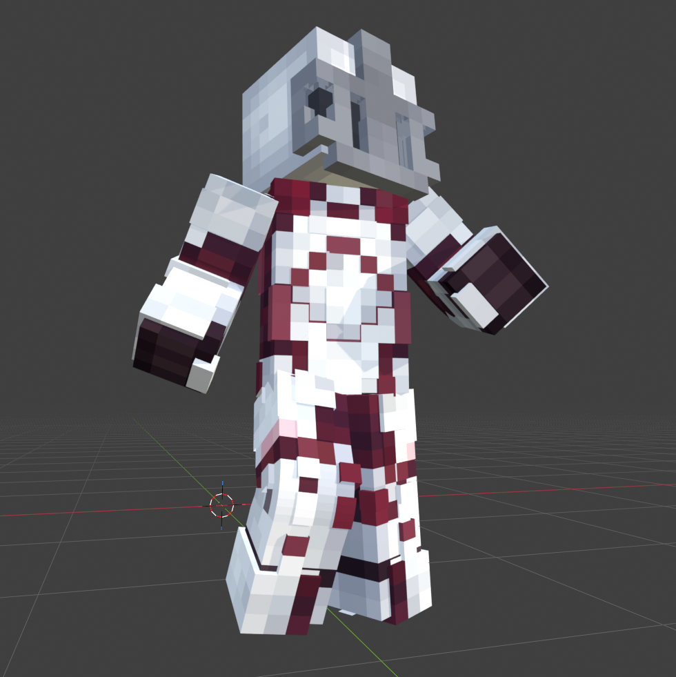

  

# Minecraft 3D Skin Layers for MCprep

[English](README_en.md)

> 一个 Blender 插件，为 MCprep 生成的 Minecraft 玩家模型添加可渲染的 3D 外层皮肤。

外层皮肤会根据皮肤纹理生成真正的体素化 3D 几何体，而不是简单地复制或加厚原有的 Layer2 外壳。

---

## 功能

- 根据皮肤纹理生成真正的 3D 外层皮肤几何体
- 支持 MCprep 的 **Simple Player** 模型
- 支持 MCprep 的 **Simple Player Slim** 模型（自动识别）
- 自动识别当前选中的玩家模型
- 可分别控制 **头部 / 身体 / 手臂 / 腿部**
- 支持 **生成 / 重建 / 删除** 3D 外层
- 支持带透明区域的皮肤
- 支持同一场景中的多个玩家模型，各自独立处理
- 支持在姿态模式下调整角色姿态，3D 外层会随对应身体部位保持关联，正常姿态调整不会破坏外层结构
- **非破坏性**：不修改 MCprep 原有的 Layer1 / Layer2、骨架、材质与皮肤图片

  

  <em>在姿态模式下调整角色姿态时，3D 外层保持与对应身体部位的关联。</em>

---

## 安装

1. 前往 [Releases](../../releases) 下载中文版安装包 `minecraft_3d_skin_layers-v1.0.0_zh.zip`
2. 打开 Blender
3. 进入 **Edit → Preferences → Add-ons**
4. 点击 **Install…**
5. 选择刚下载的 `minecraft_3d_skin_layers-v1.0.0_zh.zip`
6. 在列表中启用 **Minecraft 3D Skin Layers for MCprep**

> 请不要下载 GitHub 自动生成的 "Source code" ZIP —— 那个无法直接安装。

---

## 使用

1. 使用 MCprep 创建 Minecraft 玩家模型
2. 选中该玩家模型，或它的任意部件
3. 在 3D Viewport 中按 **N** 打开侧边栏
4. 打开 **MC 3D Skin Layers** 标签页
5. 按需勾选 **Head / Body / Arms / Legs**
6. 点击 **生成 3D 外层**

三个按钮的作用：

| 按钮 | 作用 |
| --- | --- |
| **生成 3D 外层** | 创建尚未生成的部分，已有的部分保持不变 |
| **重建 3D 外层** | 先删除本插件生成的外层，再按当前勾选重新生成 |
| **删除 3D 外层** | 只删除本插件生成的外层 |

**插件只处理当前选中的玩家模型**，不会影响场景中的其他角色。

---

## 支持的模型

目前支持 MCprep 的：

- **Simple Player**
- **Simple Player Slim**

**Simple Player Slim** 会自动识别，无需手动选择模型类型。

---

## 兼容性与限制

- **Blender 5.2.0** 或更高版本
- 需要安装 **MCprep**
- 目前只针对 **MCprep 生成的玩家模型**进行测试
- 其他 Minecraft 模型导入器或手动搭建的 Minecraft 人物模型**目前不在支持范围内**

---

## 下载

请前往 [Releases](../../releases) 页面下载：

| 语言 | 文件 |
| --- | --- |
| 中文界面 | `minecraft_3d_skin_layers-v1.0.0_zh.zip` |
| English UI | `minecraft_3d_skin_layers-v1.0.0_en.zip` |

两个安装包功能完全一致，仅用户界面语言不同。

---

## License

本项目采用 MIT License，详见 [LICENSE](LICENSE)。

---

## Credits

Developed by Yoshino.

外层皮肤的体素化算法思路参考 Minecraft Java 模组 **3D Skin Layers**（`skinlayers3d`）。

本项目为独立的第三方 Blender 插件，与 Mojang、Microsoft 或 MCprep 官方无关联，也未获得其官方认可。
